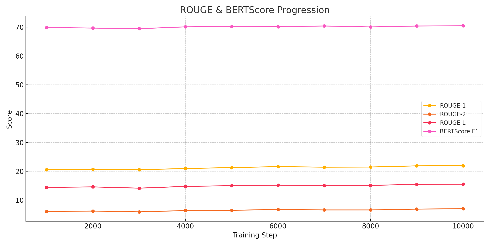
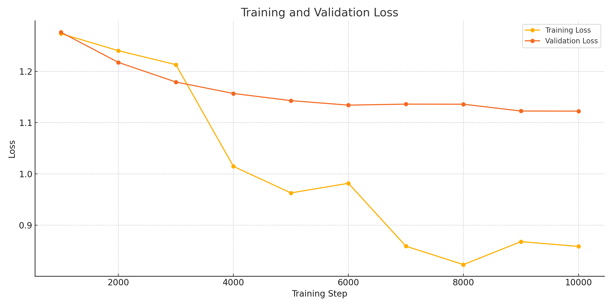

# Multilingual News Summarization System

## 📌 Project Overview
This project presents a multilingual text summarization system capable of generating high-quality, factual, and concise summaries for news articles in **English**, **Spanish**, and **Mandarin Chinese**. The model is built upon the transformer-based `mT5` architecture from Google and fine-tuned on multilingual news data. The system supports summarization tasks in the three target languages and evaluates outputs using both automatic metrics and human-guided analysis.

---

## 🔧 Technologies Used
- **Model:** [`facebook/bart-large-cnn`](https://huggingface.co/facebook/bart-large-cnn)
- **Framework:** Hugging Face Transformers
- **Training Engine:** `Seq2SeqTrainer`
- **Evaluation:** ROUGE, BERTScore, manual semantic inspection
- **Languages:** English, Spanish, Mandarin
- **Platform:** PyTorch

---

## 📁 Dataset and Preprocessing
- The dataset includes **multilingual news articles** with aligned summaries.
- Data was **balanced** by downsampling each language group to ~37,000 samples  then downsampling to ~10,000 samples to avoid language dominance and for reducing computational resources.
- Preprocessing steps:
  - Tokenization using `AutoTokenizer` with `max_input_length=512` and `max_target_length=128`
  - Padding, truncation, and label masking (`-100`)

```python
model_inputs = tokenizer(article, max_length=512, truncation=True, padding="max_length")
labels = tokenizer(summary, max_length=128, truncation=True, padding="max_length")
model_inputs["labels"] = labels["input_ids"]
```

---

## 🚀 Model Fine-Tuning

### ✅ Training Configuration
```python
training_args = Seq2SeqTrainingArguments(
    output_dir="./bart-multilingual-summarizer-new-new",
    num_train_epochs=3,
    per_device_train_batch_size=8,
    per_device_eval_batch_size=8,
    eval_strategy="steps",
    save_strategy="steps",
    save_total_limit=2,
    save_steps=100,
    eval_steps=100,
    learning_rate=1e-5,
    warmup_steps=500,
    weight_decay=0.01,
    fp16=True,
    predict_with_generate=True,
    generation_max_length=128,
    generation_num_beams=4,
    logging_dir="./logs",
    logging_steps=100,
    load_best_model_at_end=True,
    metric_for_best_model="rougeL",
    greater_is_better=True,
)
```

## 📈 Training Metrics Visualization

The following chart summarizes the evolution of key metrics over the training process:




| Step  | Train Loss | Val Loss | ROUGE-1 | ROUGE-2 | ROUGE-L | BERTScore F1 |
|-------|------------|----------|---------|---------|----------|---------------|
| 1000  | 1.2739     | 1.2766   | 20.53   | 6.05    | 14.40    | 69.89         |
| 2000  | 1.2406     | 1.2177   | 20.71   | 6.19    | 14.58    | 69.68         |
| 3000  | 1.2133     | 1.1794   | 20.53   | 5.92    | 14.13    | 69.47         |
| 4000  | 1.0149     | 1.1571   | 20.95   | 6.36    | 14.75    | 70.11         |
| 5000  | 0.9631     | 1.1432   | 21.28   | 6.44    | 14.99    | 70.23         |
| 6000  | 0.9819     | 1.1344   | 21.60   | 6.76    | 15.19    | 70.15         |
| 7000  | 0.8592     | 1.1363   | 21.42   | 6.57    | 15.02    | 70.41         |
| 8000  | 0.8233     | 1.1361   | 21.47   | 6.57    | 15.09    | 70.07         |
| 9000  | 0.8681     | 1.1229   | 21.88   | 6.86    | 15.45    | 70.39         |
|10000  | 0.8587     | 1.1226   | 21.93   | 7.01    | 15.52    | 70.48         |


### ✅ Output Sample (Step 10,000)
| Metric            | Value      |
|-------------------|------------|
| Training Loss     | 0.85       |
| Validation Loss   | 1.12       |
| ROUGE-1           | 21.93%     |
| ROUGE-2           | 7.00%      |
| ROUGE-L           | 15.52%     |
| BERTScore F1      | 70.47%     |
| Gen Length        | ~72 tokens |

---

## 📊 Evaluation Metrics

### ✅ ROUGE
- **ROUGE-1/2/Lsum** used to measure n-gram and sentence structure overlap.

### ✅ BERTScore
- Semantic similarity evaluated using `lang="multilingual"` to support Chinese and Spanish.

### ✅ Manual Review
- Summaries were manually compared against references for:
  - Semantic fidelity
  - Tone and sentiment shifts
  - Key information retention

---

## 🌐 Multilingual Bias Detection

### ✔️ Tested samples:
- 3 aligned articles (EN, ES, ZH)
- Used BERTScore across language pairs:

| Language Pair | BERTScore F1 |
|---------------|---------------|
| EN ↔ ES        | 69.08         |
| EN ↔ ZH        | 67.35         |


| Language Pair | BERTScore F1 |
|---------------|---------------|
| ES ↔ EN        | 67.3        |
| ES ↔ ZH        | 67.27         |


| Language Pair | BERTScore F1 |
|---------------|---------------|
| ZH ↔ ES        | 66.24         |
| ZH ↔ EN        | 61.66         |

### ✔️ Cultural Considerations
- Tone in Mandarin was more formal.
- Spanish outputs slightly more emotive.
- No harmful or toxic framing was detected.

---

## 💾 Saving and Uploading the Model
```python
model.save_pretrained("bart-multilingual-final")
tokenizer.save_pretrained("bart-multilingual-final")
```

### ✅ Hugging Face Upload
```python
from huggingface_hub import notebook_login
notebook_login()

model.push_to_hub("Mahmoud3899/bart-multilingual-final")
tokenizer.push_to_hub("Mahmoud3899/bart-multilingual-final")
```

Repo: [https://huggingface.co/Mahmoud3899/bart-multilingual-final](https://huggingface.co/Mahmoud3899/bart-multilingual-final)

---

## ✅ Final Conclusions

- The model successfully performs **concise, factual summarization** in 3 languages.
- Evaluation shows **high ROUGE and stable BERTScore** across languages.
- Minor issues with short output length were addressed by increasing generation parameters.
- Cultural tone variance was observed but **no harmful bias** was detected.
- The model is now publicly shareable and **ready for real-world inference or research use.**

---

## 📌 Future Improvements
- Integrate **QAG or FactCC** to evaluate factual consistency.
- Improve summary length control using **dynamic decoding**.
- Use larger `bart-multilingual-large` model for higher semantic coverage.
- Introduce **dialect-specific** fine-tuning (e.g., Latin American vs European Spanish).

---

## 📎 License
This project is open-sourced under the MIT License. Dataset use should comply with original terms.

---

## 👨‍💻 Author
**Mahmoud Reda**  
Multilingual NLP & Applied AI Developer  
[Hugging Face Profile](https://huggingface.co/Mahmoud3899)

